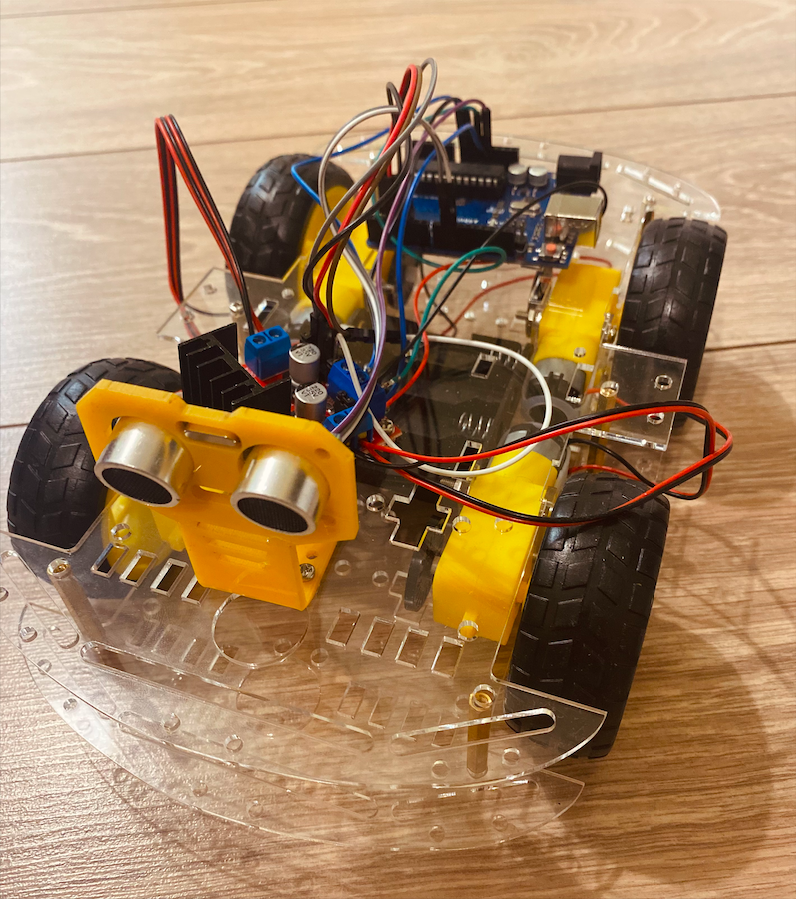
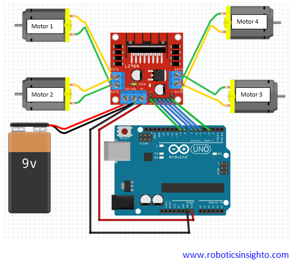
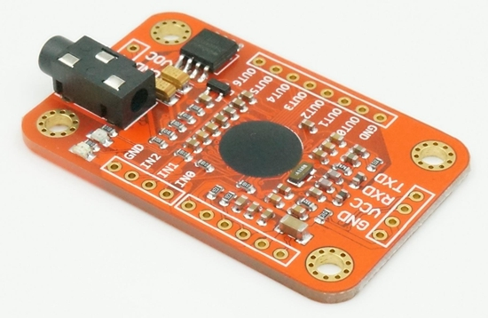
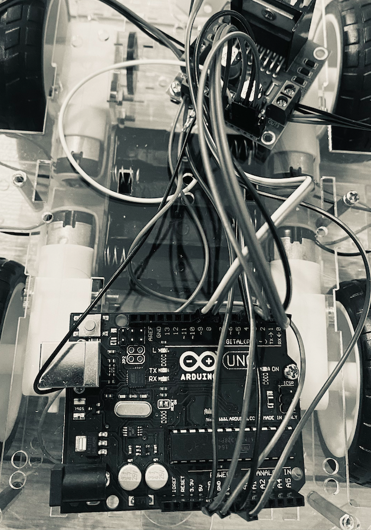
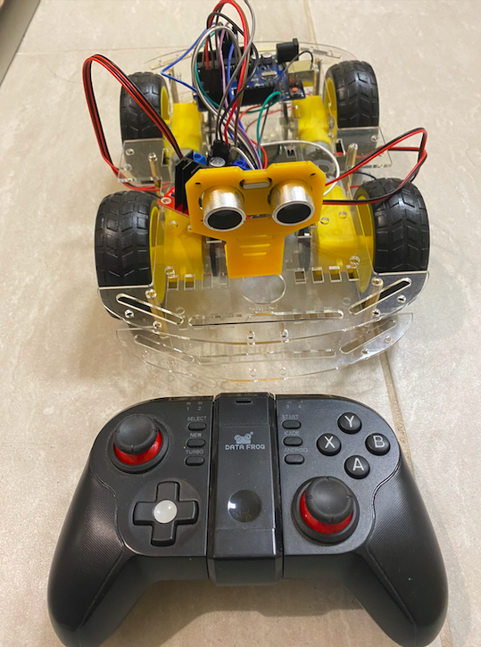
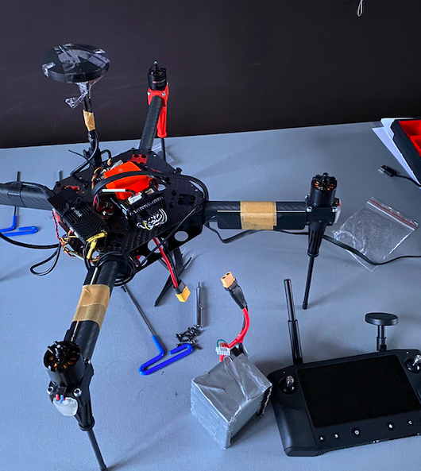
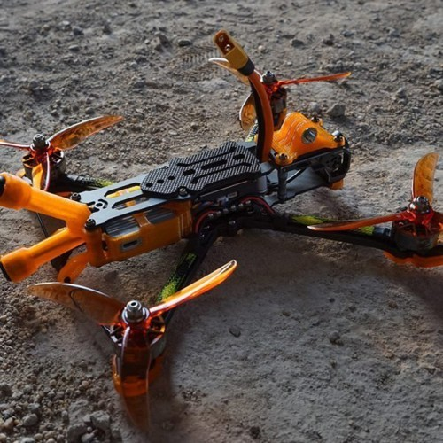
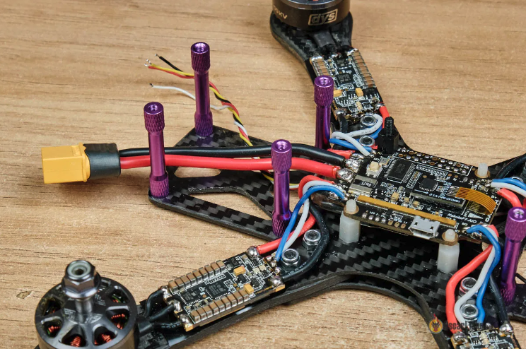

# 🤖  Robotics
Arduino, Raspberry and BreadBoard Projects

# Voice-Controlled Robot Car with Obstacle Avoidance

Build an Arduino-powered robot car that can be controlled via voice commands. Additionally, this robot features obstacle avoidance capabilities using an ultrasonic sensor.

## Components
1. Arduino UNO board
2. Motor Drive Controller (L298N)
3. 4 DC Motors with wheels
4. HC-SR04 Ultrasonic Sensor
5. Elechouse's Voice Recognition v3 Module
6. Other components: jumper wires, batteries, etc...

## Setup & Connections

### 2. Arduino Connections
- Connect the motors to the motor driver and then to the respective pins on the Arduino.
- Set up the HC-SR04 Ultrasonic Sensor & the Elechouse Module

### 3. Voice Recognition v3 Module Setup
Follow the guide from [Elechouse](https://www.elechouse.com/product/speak-recognition-voice-recognition-module-v3/) to connect and set up the module.

## Software & Coding

1. **Library Setup**: Install the `VoiceRecognitionV3` library via the Arduino IDE Library Manager.
2. **Voice Training**: Train the Voice Recognition module to recognize your commands - 'forward', 'backward', 'stop', and 'autopilot'.
3. **Code Upload**: Upload the provided code to the Arduino in this repo.
4. Connect Bluetooth Controller

## Usage

- Say "forward" to move the robot car forward.
- Say "backward" to move it backward.
- Say "stop" to halt the robot.
- Say "autopilot" to enable obstacle avoidance mode.

## Contribute
Feel free to modify, distribute, and enhance this project! Feedback and improvements are always welcomed.

# CV Drone Build

## Building a Raspberry Pi obstacle avoidance drone with computer vision, flight controller hat, voice assistance, speech to text algorithm, 4G connection for remote control, and a Python-backend:

### Hardware setup:

- Assemble the drone frame and attach the flight controller hat (such as the Navio2 or Pixhawk).
Connect the Raspberry Pi to the flight controller hat via the appropriate communication interface (e.g., SPI, I2C, UART).
Attach the Raspberry Pi Camera module for computer vision.
Connect a 4G/LTE modem or dongle to provide remote connectivity.
Install the operating system:

- Install the latest version of Raspberry Pi OS (formerly Raspbian) on an SD card.
Set up the Raspberry Pi and connect it to a network (either through Wi-Fi or Ethernet).
Install necessary libraries and dependencies:

- Install OpenCV library for computer vision tasks: pip install opencv-python.
Install Dronekit-Python for interfacing with the flight controller: pip install dronekit.
Install PyDub library for audio file manipulation (for voice assistance): pip install pydub.
Computer vision obstacle avoidance:

- Use OpenCV to capture frames from the Raspberry Pi Camera module.
Process the frames using computer vision techniques (e.g., object detection, image segmentation) to identify obstacles.
Implement an algorithm to calculate the drone's movements based on the detected obstacles and send appropriate commands to the flight controller.
Voice assistance and speech-to-text:

- Implement a speech-to-text algorithm (such as using the Google Cloud Speech-to-Text API or Mozilla DeepSpeech) to convert spoken commands to text.
Use a voice assistant library like pyttsx3 to provide voice assistance by converting text to speech.
Remote control via 4G:

- Set up the 4G/LTE modem or dongle to establish an internet connection.
Implement a communication protocol (e.g., TCP/IP or MQTT) to transmit commands from a remote device to the drone.
Create a server on the drone to receive and interpret commands from the remote device.
Encode and decode the commands sent between the remote device and the drone using an appropriate protocol.
Python code and implementation:

- Write Python scripts to handle computer vision, flight control, voice assistance, speech-to-text, and remote control functionalities.
Implement multithreading or asynchronous programming to handle concurrent tasks.
Test and iterate on the code to ensure proper integration and functionality.
React GUI for controller:

- Set up a React.js development environment.
Design and develop a user interface (UI) using React components for the remote control application.
Implement communication with the drone using the established communication protocol.
Deploy the React app to a suitable hosting platform.

## Cloud Platform Setup:

- Develop a cloud platform using React for the frontend and Python (Django or Flask) for the backend.
Implement user registration, authentication, and API endpoints.
Raspberry Pi Configuration:

- Install an appropriate operating system (e.g., Raspberry Pi OS) on the Raspberry Pi.
Set up WiFi or connect the Raspberry Pi to the 4G module for internet connectivity.
Install Required Software:

- Install Python on the Raspberry Pi for running local operations.
Install any necessary libraries or dependencies for communication and data processing.
Establish Communication:

- Implement RESTful APIs on the backend & communication protocol with the Raspberry Pi.
Configure the Raspberry Pi to make HTTP requests to these APIs.
Remote Control Logic:

- Develop the cloud platform frontend to send control signals to the backend API.
Implement backend logic to interpret and process these signals.
Receive and Process Signals:

- Create API endpoints on the backend to receive control signals from the cloud platform.
Develop Raspberry Pi code to make requests to these endpoints and execute corresponding actions.
Data Transmission:

- Design a mechanism for the Raspberry Pi to send data back to the cloud platform, such as telemetry data or status updates.
Implement APIs on the backend to receive and store this data.
Security Measures:

- Implement token-based authentication for API endpoints to secure communication between the cloud platform and Raspberry Pi.
Use HTTPS to encrypt data transmission.
Test and Optimize:

- Test communication between the cloud platform and Raspberry Pi.
Optimize the API calls and data transmission for efficiency.
Deployment and Monitoring:

- Deploy the cloud platform to a reliable server accessible via the internet.
Set up monitoring tools to track the platform's performance and diagnose any issues.
Scalability and Iteration:

- Consider scaling up your cloud infrastructure as user demand increases.
Collect user feedback and iterate on both the frontend and backend components.

- Integrate satellite communication if necessary (this might be complex and requires specific modules).
- Autopilot can be implemented using libraries like DroneKit which work with the Mamba flight controller.
- Object avoidance can be achieved using ultrasonic sensors & Lidar connected to the Pi. The ADAS (Advanced Driver Assistance System) will require additional programming and integration, ensuring that it works in tandem with the flight controller.
