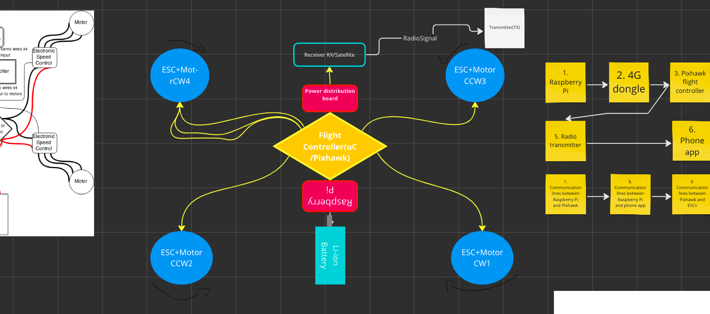
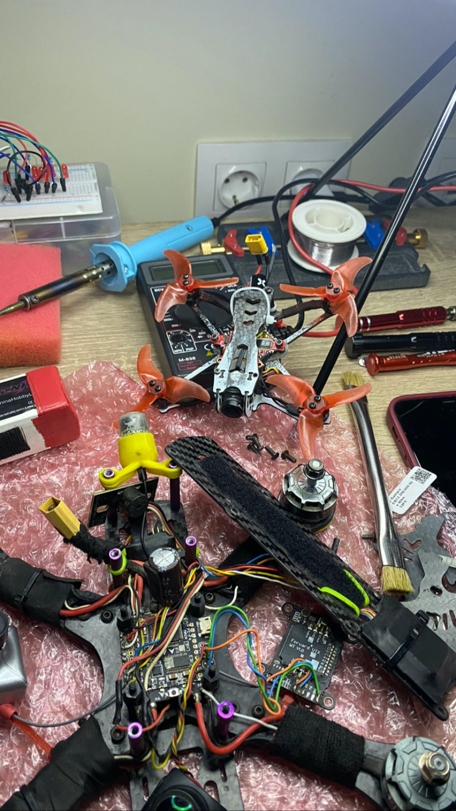
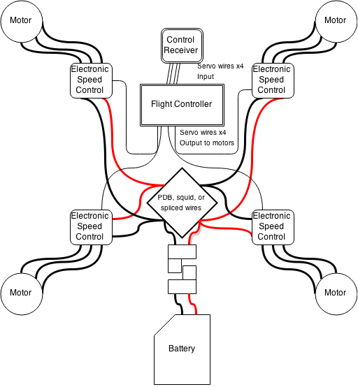

# 🤖  Robotics
Arduino, Raspberry and BreadBoard Projects

## Table of Contents
- [MindStorms EV3 System](#mindstorms-ev3)
- [RaspberryPi & Jevois Smart Cam](#raspberry-jevois)
- [Building FPV Drones](#fpv-drone-build)
- [Arduino Robot Car UltraSonic](#robot-car-with-obstacle-avoidance-and-va)
- [AI Drone Build](#cv-drone-build)


## Mindstorms EV3 System Documentation

**This documentation elaborates on two separate EV3 brick systems:**

1. Carrier Line Follower: A robotic system that autonomously follows a line and responds to color cues (via light reflection sensor ).
2. Sorting Conveyor and Lift: A conveyor belt system with sorting capabilities based on color recognition, ultrasonic detection and a timed lift mechanism.

# 1. Carrier Line Follower
The Carrier Line Follower is designed to autonomously navigate a path marked by a line, using color cues for specific maneuvers like turning, slowing or stopping.

*Code Logic*

##Initialization:

- EV3 Brick: Serves as the brain of the robot.
- Motors: Two motors are initialized for the left and right wheels, controlling the robot's movement.
- Color Sensor: Detects the color of the surface beneath it, crucial for line following and decision-making.
- Drive Base: Combines the two motors and the wheel diameters for coordinated movement.
- DRIVE_SPEED: Sets the robot's forward speed.
##Functions:
-  turnRight90(): Executes a 90-degree right turn, including a beep sound as a signal. The waiting times and motor speeds are adjusted to achieve the turn.
-  slowDown(): Reduces the robot's speed and emits a beep sound, signifying a change in pace.
-  stopMoving(): Immediately halts the robot.

##Main Loop:

- Continuously reads the color detected by the sensor.
- Line Following Logic: can be the other way around or with PID of deviation between the light reflection values from the brick, but in the release case - the carrier is simply adjusting the turning rate between the colors white/black (for better performance)
- - On white surfaces, the robot slightly turns left.
- - On black surfaces, it slightly turns right.
- Color-Based Actions:
- - Red: Initiates a 90-degree right turn.
- - Blue: Slows down the robot.
- - Green: Stops the robot and ends the loop.


#Full Code

```
#!/usr/bin/env pybricks-micropython

from pybricks.ev3devices import Motor, ColorSensor
from pybricks.parameters import Port, Color
from pybricks.tools import wait
from pybricks.robotics import DriveBase
from pybricks.hubs import EV3Brick

# Initialize
#EV3 brick
ev3 = EV3Brick()
# motors.
left_motor = Motor(Port.B)
right_motor = Motor(Port.C)
# color sensor.
line_sensor = ColorSensor(Port.S3)
# drive base.
robot = DriveBase(left_motor, right_motor, wheel_diameter=80, axle_track=96)

# Set the drive speed.
DRIVE_SPEED = 120

# Adjust the proportional gain. - not in use anymore, because of changing from PID of deviation between the light reflection values from the brick to simply adjusting the turning rate between the colors white/black (better performance)
#PROPORTIONAL_GAIN = 2

# Function to stop the robot's movement.
def stopMoving():
    robot.stop()

# Function to turn the robot right by approximately 90 degrees.
def turnRight90():
    stopMoving()
    ev3.speaker.beep(frequency=600, duration=300)
    wait(100)
    left_motor.run(150)
    right_motor.run(150)
    wait(300)
    left_motor.run(200)
    right_motor.run(-200)
    wait(1000)  # Adjust time as needed. To turn properly
    stopMoving()

def slowDown():
    ev3.speaker.beep(frequency=600, duration=300)
    # wait(100)
    left_motor.run(200)
    right_motor.run(200)
    wait(300)
    stopMoving()
    ev3.speaker.beep(frequency=600, duration=300)

# Start following the line continuesly.
while True:

    # Read the detected color from the sensor in color-based mode.
    detected_color = line_sensor.color()

    #stay in line
    if detected_color == Color.WHITE:
        robot.drive(DRIVE_SPEED, -20)
    elif detected_color == Color.BLACK:
        robot.drive(DRIVE_SPEED, 20)

    # Check for red color and turn right.
    elif detected_color == Color.RED:
        turnRight90()
        continue

    # Check for blue color and slow down.   *CALIBRATE FOR BLUE from parameters
    if detected_color == Color.BLUE:
        slowDown()
        continue

    # Check for green color and stop.
    elif detected_color == Color.GREEN:
        ev3.speaker.beep(frequency=200, duration=200)
        stopMoving()
        break


    wait(10)


"""Old method
BLACK = 1
WHITE = 86
threshold = (BLACK + WHITE) / 2

# Start following the line continuesly.
while True:
    # Read the reflection value from the sensor for line following.
    current_reflection = line_sensor.reflection()

    # Read the detected color from the sensor for color-based actions.
    detected_color = line_sensor.color()

    # Check for blue color and turn right.
    if detected_color == Color.BLUE:
        turnRight90()
        continue

    # Check for green color and stop.
    if detected_color == Color.GREEN:
        stopMoving()
        break

    # Calculate the deviation from the threshold for line following.
    error = current_reflection - threshold
    integral += error
    derivative = error - last_error
    turn_rate = PROPORTIONAL_GAIN * error + INTEGRAL_GAIN * integral + DERIVATIVE_GAIN * derivative
    last_error = error

    # Adjust robot movement based on the line following logic.
    robot.drive(DRIVE_SPEED, turn_rate)

    # Short wait or other actions.
    wait(10)"""

```

# 2. Sorting Conveyor

##System Description
This system sorts objects using a conveyor belt mechanism based on their color, detected by a color sensor. After a fixed duration, a lift mechanism is activated and the whole system is stopped.

##Detailed Code Logic
###Initialization:

- Motors: Separate motors for the conveyor, cube pusher, and  mechanism.
- Sensors: A color sensor for detecting object colors and an ultrasonic sensor for carrier proximity detection.
- Conveyor, cube pusher and lift speed is set.
- Alignment delay is set
- Duration of each motor operating time is set.
- MAX_DISTANCE: Determines the activation distance for the system.
- Carrier Check Initial State is set to False
- Timer Initial State is set to False
###Functions:

- lift(): Activates the lift mechanism after a set time.
- Main Loop:
- - Carrier Detection: Uses the ultrasonic sensor to detect the presence of a carrier within a specified distance.
- - Conveyor Operation: When a carrier is detected, the conveyor starts moving.
- - Color Detection and Sorting:
Scans the object's color on the conveyor.
If a black object is detected, a pusher mechanism is activated to sort the object.
- - Timer Check: After 40 seconds from the conveyor start, the lift mechanism is activated, and the loop ends.


#Full Code

```
#!/usr/bin/env pybricks-micropython

from pybricks.ev3devices import Motor, ColorSensor, UltrasonicSensor
from pybricks.parameters import Port, Color
from pybricks.tools import wait
from pybricks.hubs import EV3Brick
import time

# Initialize EV3 brick
ev3 = EV3Brick()

# Initialize the motors and sensors.
conveyor_motor = Motor(Port.A)
pusher_motor = Motor(Port.B)
lift_motor = Motor(Port.C)
# Initialize the color sensor.
color_sensor = ColorSensor(Port.S3)
# Init UltraSonic Sensor.
ultra_sensor = UltrasonicSensor(Port.S4)

# Conveyor, pusher, lift, ultrasonic and timer presets.
CONVEYOR_SPEED = -150 # Speed of the conveyor belt
PUSHER_SPEED = 800 #Speed of black cube pusher
PUSHER_RETURN_SPEED = -800 # Speed to return the pusher to starting position
PUSHER_DURATION = 550 # Duration for which the pusher motor runs
ALIGNMENT_DELAY = 920 # Delay for cube alignment
LIFT_DURATION = 3200
LIFT_SPEED = 200
MAX_DISTANCE = 200 #Max distance of carrier from conveyor in mm before it starts the system and count down
carrierCheck = False
timerStarted = False

#lift function after timout (40secs)
def lift():
    ev3.speaker.beep(frequency=800, duration=100)
    lift_motor.run(LIFT_SPEED)
    wait(LIFT_DURATION)

# Main loop for the conveyor system.
while True:
     #check for carrier nearby (20cm)
    if ultra_sensor.distance() < MAX_DISTANCE:
        carrierCheck = True

        #check if timer has started in order to start it initially
        if not timerStarted:
            start_time = time.time()
            timerStarted = True

    #Start the system when carrier arrives
    if carrierCheck:
        #start conveyor motor
        conveyor_motor.run(CONVEYOR_SPEED)
        #checking colors via light reflection sensor
        current_color = color_sensor.color()
        if current_color in [Color.RED, Color.GREEN, Color.BLUE]:
            ev3.speaker.beep(frequency=800, duration=100)

        # Activate the pusher to move the cube.
        if current_color == Color.BLACK:    #to calibrate config the parameters
            ev3.speaker.beep(frequency=50, duration=400)
            wait(ALIGNMENT_DELAY)
            pusher_motor.run_time(PUSHER_SPEED, PUSHER_DURATION)
            pusher_motor.run_time(PUSHER_RETURN_SPEED, PUSHER_DURATION)

     # Check if 40 seconds have passed
    if timerStarted and time.time() - start_time > 40:
        ev3.speaker.beep(frequency=200, duration=200)
        lift()
        break # Break out of the loop after 40 seconds

    wait(10)  # Small delay for the loop


"""Previous version
#!/usr/bin/env pybricks-micropython

from pybricks.ev3devices import Motor, ColorSensor, UltrasonicSensor
from pybricks.parameters import Port, Color
from pybricks.parameters import Port
from pybricks.tools import wait
from pybricks.hubs import EV3Brick
import time


# Initialize EV3 brick
ev3 = EV3Brick()


# Initialize the motors.
conveyor_motor = Motor(Port.A)  # Motor for the conveyor belt
pusher_motor = Motor(Port.B)    # Motor for pushing the cube

# Initialize the color sensor.
color_sensor = ColorSensor(Port.S3)
# Init UltraSonic Sensor.
ultra_sensor = UltrasonicSensor(Port.S4)

# Initialize lift the motor.
lift_motor = Motor(Port.C)  # Motor for the lift

LIFT_DURATION = 3200
LIFT_SPEED = 200

# Conveyor and pusher settings.
CONVEYOR_SPEED = -150  # Speed of the conveyor belt
PUSHER_SPEED = 800    # Increased speed for a faster push
PUSHER_RETURN_SPEED = -800  # Speed to return the pusher to starting position
PUSHER_DURATION = 550 # Duration for which the pusher motor runs
ALIGNMENT_DELAY = 920 # Delay for cube alignment

#Max distance of carrier from conveyor in mm
MAX_DISTANCE = 200
carrierCheck = False

def lift():
    ev3.speaker.beep(frequency=800, duration=100)
    lift_motor.run(LIFT_SPEED)
    wait(LIFT_DURATION)

# Init the start time
start_time = time.time()

# Main loop for the conveyor system.
while True:

    # Check if 40 seconds have passed
    if time.time() - start_time > 40:
        ev3.speaker.beep(frequency=200, duration=200)
        lift()
        break  # Break out of the loop after 40 seconds

    #check for carrier nearby (10cm)
    if ultra_sensor.distance() < MAX_DISTANCE:
        carrierCheck = True

    #check for carrier nearby (10cm)
    if carrierCheck == True:

        # Start the conveyor motor.
        conveyor_motor.run(CONVEYOR_SPEED)

        # Read the reflection value from the sensor.
        current_color = color_sensor.color()

        if current_color == Color.RED or current_color == Color.GREEN or current_color==Color.BLUE:
            ev3.speaker.beep(frequency=800, duration=100)


        # Check if the reflection indicates a black surface.
        if current_color == Color.BLACK:
            ev3.speaker.beep(frequency=50, duration=400)
            # Wait for the cube to align with the pusher.
            wait(ALIGNMENT_DELAY)

            # Activate the pusher to move the cube.
            pusher_motor.run_time(PUSHER_SPEED, PUSHER_DURATION)
            #wait(PUSHER_DURATION)

            # Return the pusher to its starting position.
            pusher_motor.run_time(PUSHER_RETURN_SPEED, PUSHER_DURATION)
            #wait(PUSHER_DURATION)

        wait(10)  # Small delay for the loop"""


```

## Raspberry Pi + Jevois System -> find more in repo /RaspberryPi_Jevois

## FPV Drone Build

### How to set up: [FPV Drone Setup Guide](config_requirements.md)







## Robot Car with Obstacle Avoidance and VA

Build an Arduino-powered robot car that can be controlled via voice commands. Additionally, this robot features obstacle avoidance capabilities using an ultrasonic sensor.


## Components
1. Arduino UNO board
2. Motor Drive Controller (L298N)
3. 4 DC Motors with wheels
4. HC-SR04 Ultrasonic Sensor
5. Elechouse's Voice Recognition v3 Module
6. Other components: jumper wires, batteries, etc...


## Setup & Connections


### 2. Arduino Connections
- Connect the motors to the motor driver and then to the respective pins on the Arduino.
- Set up the HC-SR04 Ultrasonic Sensor & the Elechouse Module


### 3. Voice Recognition v3 Module Setup
Follow the guide from [Elechouse](https://www.elechouse.com/product/speak-recognition-voice-recognition-module-v3/) to connect and set up the module.

## Software & Coding

1. **Library Setup**: Install the `VoiceRecognitionV3` library via the Arduino IDE Library Manager.
2. **Voice Training**: Train the Voice Recognition module to recognize your commands - 'forward', 'backward', 'stop', and 'autopilot'.
3. **Code Upload**: Upload the provided code to the Arduino in this repo.
4. Connect Bluetooth Controller


## Usage

- Say "forward" to move the robot car forward.
- Say "backward" to move it backward.
- Say "stop" to halt the robot.
- Say "autopilot" to enable obstacle avoidance mode.

## Contribute
Feel free to modify, distribute, and enhance this project! Feedback and improvements are always welcomed.


## CV Drone Build

## Building a Raspberry Pi computer vision powered drone with autonomous flight assistant mode, flight controller hat, voice assistance, speech to text algorithm, 4G hat for remote control, and a Python-backend:


### Hardware setup:

- Assemble the drone frame and attach the flight controller (such as Pixhawk or some simpler uC).
Connect the Raspberry Pi to the flight controller hat via the appropriate communication interface (e.g., SPI, I2C, UART).
Attach the Raspberry Pi Camera module for manimupaltion and programming.
Connect a 4G/LTE modem or dongle to provide remote connectivity.

Install the operating system:

- Install the latest version of Raspberry Pi OS (formerly Raspbian) on an SD card.
Set up the Raspberry Pi and connect it to a network (either through Wi-Fi or Ethernet).

Install necessary libraries and dependencies:

-Create your own backend processing or use pretrained models and already built libraries
- Install OpenCV library for computer vision tasks: pip install opencv-python.
Install Dronekit-Python for interfacing with the flight controller: pip install dronekit.
Install HuggingFace/VA/LLM libraries for speech to text and reverted manipulation (for voice assistance) OR build your own with TensorFlow

Computer vision obstacle avoidance:

- Use OpenCV to capture frames from the Raspberry Pi Camera module.
Process the frames using computer vision techniques (e.g., object detection, image segmentation) to identify obstacles.
Implement an algorithm to recognize the obsticles from the training and calculate the drone's movements based on the detected obstacles and send appropriate commands to the flight controller.

Voice assistance and speech-to-text:

- Implement a speech-to-text algorithm (such as using the Google Cloud Speech-to-Text API or Mozilla DeepSpeech) to convert spoken commands to text.
Use a voice assistant library like pyttsx3 to provide voice assistance by converting text to speech.

Remote control via 4G:

- Set up the 4G/LTE modem or dongle to establish an internet connection.
Implement a communication protocol (TCP/IP or MQTT) to transmit commands from a remote device to the drone.
Create a server on the drone to receive and interpret commands from the remote device.
Encode and decode the commands sent between the remote device and the drone using an appropriate protocol.

Python code and implementation:

- Write Python scripts to handle computer vision, flight control, voice assistance, speech-to-text, and remote control functionalities.
Implement multithreading or asynchronous programming to handle concurrent tasks.
Test and iterate on the code to ensure proper integration and functionality.

React GUI for controller:

- Set up a React.js development environment.
Design and develop a user interface (UI) using React components for the remote control application.
Implement communication with the drone using the established communication protocol.
Deploy the React app to a suitable hosting platform like FireBase or AWS; Connect and establish a database for data handling.

Establish Communication:

- Use MAVlink & WebSockets for communication.
- Implement RESTful APIs on the backend & communication protocol with the Raspberry Pi.
Configure the Raspberry Pi to make HTTP requests to these APIs.
- Design a way for the Raspberry Pi to send data back to the cloud platform, such as telemetry data or status updates.
Implement APIs on the backend to receive and store this data.

Security Measures:

- Implement token-based authentication for API endpoints to secure communication between the cloud platform and Raspberry Pi.
Use HTTPS to encrypt data transmission.

Test and Optimize:

- Test communication between the cloud platform and Raspberry Pi.
Optimize the API calls and data transmission for efficiency.
- Simulate the flight first and then test it in the real enviroment ON A STRING to avoid LOSING the drone in the AIR!

Scalability and Iteration:

- Consider scaling up your cloud infrastructure as user demand increases.
Collect user feedback and iterate on both the frontend(interface) and backend(communication & manimulation) components.

- Integrate satellite communication if necessary (this might be complex and requires specific modules).
- Autopilot can be implemented with your own model and reinforcement learning instead of using libraries like DroneKit.
- Object avoidance can be achieved using ultrasonic sensors & Lidar connected to the Pi. The AFAS (Advanced Flight Assistance System) will require additional programming and integration, ensuring that it works in tandem with the flight controller.
